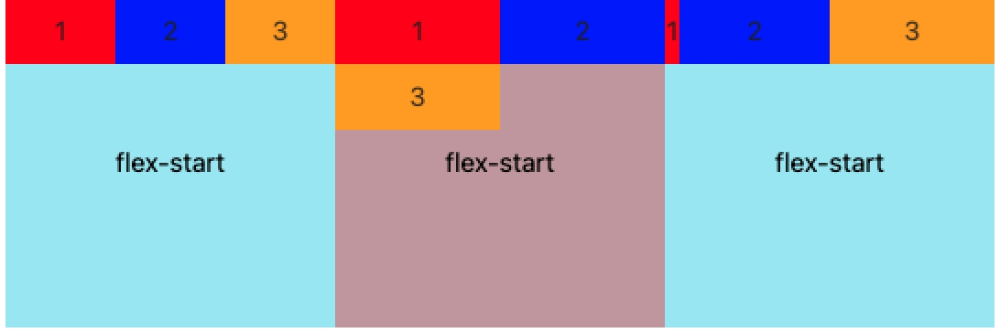
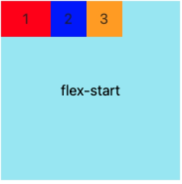
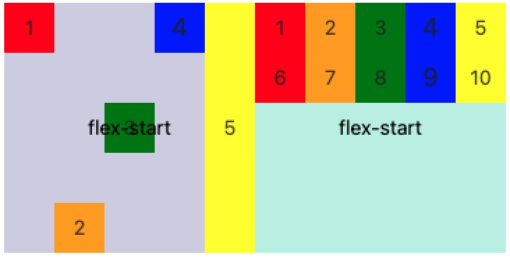

# Flex 布局

Flex 是 Flexible Box 的缩写，意思就是“弹性布局”。它的作用就是为盒状模型提供最大的灵活性。`任何容器都可以指定为Flex布局`。

# 容器属性

- flex-direction
- flex-wrap
- flex-flow
- justify-content
- align-items
- align-content

## flex-direction

决定主轴方向。`flex-direction` 有4个值的含义

```
.container{
	flex-direction: row | row-reverse | column | column-reverse
}
```

- row 主轴水平方向,左起点
- row-reverse 主轴水平方向，右起点
- column 主轴垂直方向，上起点
- column-reverse 主轴垂直方向，下起点

### 例子


## flex-wrap

默认情况下，所有的项目都排列在一条线上（又称为“轴线“）。`flex-wrap`属性定义， 如果在一条轴线上排不下，如何换行。

默认交叉轴是行是等分的，需要设置`align-content:flex-start`使得cell从上往下排列。如图4

```
.container{
	flex-wrap: flex-wrap: nowrap | wrap | wrap-column
}
```

- nowrap： 默认值，不换行
- wrap：自上而下换行
- wrap-reverse：自下而上换行

### 例子


## flex-flow

`flex-flow`属性是`flex-direction`属性和`flex-wrap`属性的简写形式。默认值：row nowrap;

```
.container {
	flex-flow: <flex-direction> | <flex-wrap>
}
```

## justify-content

justify-content属性定义了项目在主轴上的对齐方式。

```
.container{
	justify-content: flex-start | flex-end | center| space-between | space-around
}
```

- flex start: 默认值，主轴的起点对齐
- flex-end： 主轴的终点对齐
- center：居中
- space-between：两端对齐，项目之间的间隔是相等的
- space-around： 每个项目两侧的距离相等，所以项目之间的间距与项目与边框的间距要大

### 例子


## align-items

`align-items` 属性定义项目在交叉轴的对齐方式。交叉轴方向高度或者宽度会影响默认效果。如图5第一个cell设置高度后交叉轴未填满

```
.container{
    align-items: flex-start |flex-end | center | baseline| stretch
}
```

- flex-start:: 交叉轴的起点对齐
- flex-end: 交叉轴的终对齐
- center：居中
- baseline： 项目的第一行文字基线对齐
- stretch: 默认值， 如果项目未设置高度或者设置高度为auto，将铺满整个容器的高度

### 例子


## align-content

`align-content`属性设置了多根轴线的对齐方式.数据与`align-items`类似。该属性一定要配合`flex-wrap:wrap`使用，优先级高于`align-items`。

值得注意的是后面的cell交叉轴高度大于前的cell时会引起前面的cell出现白边

```
.container{
    align-items: flex-start |flex-end | center | baseline| stretch
}
```

- flex start:: 交叉轴的起点对齐
- flex end: 交叉轴的终对齐
- center：居中
- stretch： 默认值， 如果项目未设置高度或者设置高度为auto，将铺满整个容器的高度
- space-between:与交叉轴两端对齐，轴线之间的间隔平均分布
- space-around：每根轴线两侧的间隔都相等。轴线之间的间隔比轴线与边框的间隔大一倍
- stretch：默认值，占满整个容器

### 例子


# 项目属性

- order
- flex-grow
- flex-shrink
- flex-basis
- flex
- align-self

## order

`order` 属性定义项目的排列顺序，数值越小，排列越靠前， 默认值为0。图例给第一个item设置了4,所以牌子最后面

```
.item {
  order: <number>;
}
```

### 例子


## flex-grow

`flex-grow` 属性定义项目的放大比列。默认为0，即 即使存在剩余空间，也不放大,对多行交叉轴有剩余空间的行有效。

如果所有项目的flex-grow属性都为1，则它们将等分剩余空间（如果有的话）。

如果一个项目的flex-grow属性为4，其他项目都为1，则前者占据的剩余空间将比其他多4倍。

```
.item {
  flex-grow: <number>;
}
```

### 例子


## flex-shrink

`flex-shrink`属性定义项目的缩小比例，默认值为1， 如果剩余空间不足，项目将缩小。

图一代表flex-shrink都为1，如果所有项目的flex-shrink属性都为1，当空间不足时，都将等比例缩小

图二代表第一个flex-shrink为10,其余为1，如果所有项目的flex-shrink属性都为1，其他的flex-shrink 为10，那么后者的缩小比例是前者的10倍

图二代表第一个flex-shrink为10,第二个为1，第三个为0，如果一个项目的flex-shrink属性为0，其他项目都为1，则空间不足时，前者不缩小。

```
.item {
  flex-shrink: <number>; /* default 1 */
}
```

### 例子



## flex-basis

`flex-basis`属性定义在分配剩余空间之前， 项目占主轴的空间。浏览器根据这个属性，计算主轴是否有多余空间。它的默认值为auto，即项目的本来大小,可以代表高度或者是宽度,在flex-direction:row下及可以理解为宽度，但是权重高于width。设置auto后由宽度或者高度决定主轴方向的长度.

例子中对第一个cell同时设置了`width:30px;flex-basis: 55px;`,单元格宽度55

```
.item {
  flex-basis: <length> | auto; /* default auto */
}
```

### 例子



## flex

`flex`属性是flex-grow flex-shrink flex-basis 的简写，默认值为0 1 auto。后两个属性可选。

- flex:1 代表能放能缩
- flex:none 代表不能放不能缩

设置了flex:1理论上无法进行换行，因为他既能放大又能缩小。但是你可以通过flex-basic在分配剩余空间之前占据主轴空间

### 例子


## align-self

属性允许单个项目与其他项目不一样的对齐方式，可覆盖align-items，默认值为auto，表示继承父级的align-items。如果没有父元素，则等同于stretch。对多行交叉轴无效

```
.item {
  align-self: auto | flex-start | flex-end | center | baseline | stretch;
}
```

### 例子


